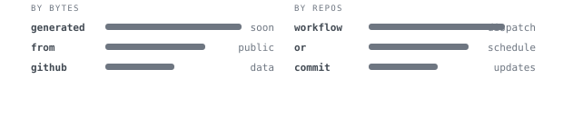

# Vamsi Krishna

**Final Year Student at VIT**

[portfolio](https://thekrishna.me) &nbsp;·&nbsp;
[linkedin](https://www.linkedin.com/in/pvamsikrishna/) &nbsp;·&nbsp;
[twitter](https://x.com/justvamsi7) &nbsp;·&nbsp;
[github](https://github.com/raptor7197) &nbsp;·&nbsp;
[holopin](https://holopin.io/@raptor7197)

> Final year student at VIT. 
> Linux enthusiast, open-source minded, and curious about infra, systems, web, and AI.

I like building practical things, learning by shipping, and exploring tools across 
backend, frontend, machine learning, developer tooling, and infrastructure workflows.

<samp>javascript &nbsp; typescript &nbsp; python &nbsp; java &nbsp; c++ &nbsp; bash &nbsp; go &nbsp; mysql &nbsp; linux &nbsp; git &nbsp; lua &nbsp; latex &nbsp; markdown</samp>

  

**Frameworks / libraries / tools**

<samp>react &nbsp; next.js &nbsp; node.js &nbsp; express &nbsp; tailwind &nbsp; vite &nbsp; pytorch &nbsp; tensorflow &nbsp; scikit-learn &nbsp; docker</samp>

**Open source + Linux** &nbsp;·&nbsp; <samp>systems, tooling</samp> 
I enjoy Linux environments, exploring developer tooling, building with open technologies,
clean tooling, and practical build-first workflows.

**Full-spectrum builder** &nbsp;·&nbsp; <samp>web, backend, infra, ML</samp> 
Comfortable moving between programming fundamentals, web stacks, machine learning tooling,
and infrastructure-oriented workflows — from UI work to APIs and app plumbing.

**Learning now** &nbsp;·&nbsp; <samp>deep learning, ONNX, Q#</samp> 
Currently exploring deep learning, ONNX, Q#, and applied experimentation with real projects.

## current direction

I’m interested in the intersection of:

- developer tools
- web development
- machine learning
- open source
- systems and Linux workflows

## badges

<pre>
██╗  ░█████╗░███╗░░░███╗  ░░░░░██╗██╗░░░██╗░██████╗████████╗
██║  ██╔══██╗████╗░████║  ░░░░░██║██║░░░██║██╔════╝╚══██╔══╝
██║  ███████║██╔████╔██║  ░░░░░██║██║░░░██║╚█████╗░░░░██║░░░
██║  ██╔══██║██║╚██╔╝██║  ██╗░░██║██║░░░██║░╚═══██╗░░░██║░░░
██║  ██║░░██║██║░╚═╝░██║  ╚█████╔╝╚██████╔╝██████╔╝░░░██║░░░
╚═╝  ╚═╝░░╚═╝╚═╝░░░░░╚═╝  ░╚════╝░░╚═════╝░╚═════╝░░░░╚═╝░░░

██████╗░███████╗██╗░░░░░░█████╗░████████╗██╗██╗░░░██╗███████╗██╗░░░░░██╗░░░██╗  ██╗░░░░░███████╗░██████╗░██████╗
██╔══██╗██╔════╝██║░░░░░██╔══██╗╚══██╔══╝██║██║░░░██║██╔════╝██║░░░░░╚██╗░██╔╝  ██║░░░░░██╔════╝██╔════╝██╔════╝
██████╔╝█████╗░░██║░░░░░███████║░░░██║░░░██║╚██╗░██╔╝█████╗░░██║░░░░░░╚████╔╝░  ██║░░░░░█████╗░░╚█████╗░╚█████╗░
██╔══██╗██╔══╝░░██║░░░░░██╔══██║░░░██║░░░██║░╚████╔╝░██╔══╝░░██║░░░░░░░╚██╔╝░░  ██║░░░░░██╔══╝░░░╚═══██╗░╚═══██╗
██║░░██║███████╗███████╗██║░░██║░░░██║░░░██║░░╚██╔╝░░███████╗███████╗░░░██║░░░  ███████╗███████╗██████╔╝██████╔╝
╚═╝░░╚═╝╚══════╝╚══════╝╚═╝░░╚═╝░░░╚═╝░░░╚═╝░░░╚═╝░░░╚══════╝╚══════╝░░░╚═╝░░░  ╚══════╝╚══════╝╚═════╝░╚═════╝░

██████╗░██╗░░░██╗███╗░░░███╗██████╗░███████╗██████╗░
██╔══██╗██║░░░██║████╗░████║██╔══██╗██╔════╝██╔══██╗
██║░░██║██║░░░██║██╔████╔██║██████╦╝█████╗░░██████╔╝
██║░░██║██║░░░██║██║╚██╔╝██║██╔══██╗██╔══╝░░██╔══██╗
██████╔╝╚██████╔╝██║░╚═╝░██║██████╦╝███████╗██║░░██║
╚═════╝░░╚═════╝░╚═╝░░░░░╚═╝╚═════╝░╚══════╝╚═╝░░╚═╝
</pre>
